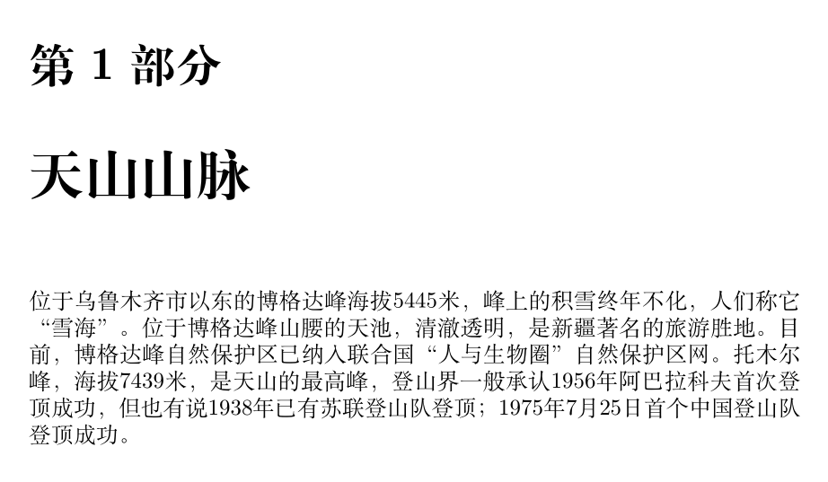

# Chinese

Chinese is available for `xetex` and `luatex`. With the latter, both
renderers (the default and Harfbuzz) are fine.

Note the best option is usually to resort to a dedicated framework like
[CTeX](https://ctan.org/pkg/ctex), [CJK](https://ctan.org/pkg/cjk) or
[ChineseJFM](https://ctan.org/pkg/chinese-jfm). However, for simple
documents in horizontal writing, as well as a few words or sentences in
a multilingual document, `babel` should be enough.

Here is a short example:
```tex
\documentclass{book}

\usepackage[chinese, provide=*]{babel}

\babelfont{rm}{FandolSong}

\begin{document}

\chapter{天山山脉}

位于乌鲁木齐市以东的博格达峰海拔5445米，峰上的积雪终年不化，人们称它“雪海”。位于博格达峰山腰的天池，清澈透明，是新疆著名的旅游胜地。目前，博格达峰自然保护区已纳入联合国“人与生物圈”自然保护区网。托木尔峰，海拔7439米，是天山的最高峰，登山界一般承认1956年阿巴拉科夫首次登顶成功，但也有说1938年已有苏联登山队登顶；1975年7月25日首个中国登山队登顶成功。

\end{document}
```



## Line breaking

Rules are harcoded in XeTeX, but in LuaTeX a line breaking mechanism
has been devised, based on (but not strictly following) the Unicode
algorithm.

Justification in both engines is controlled by a couple of options in
`\babelprovide`.

* `intraspace` sets the inner spaces in em units (so, `0 .1 0` is 0em
  plus .1em). The em unit applied is that of the current text (more
  precisely, the previous glyph).
* `intrapenalty` sets the inner penalty of the breaking opportunities.

There is in addition the posibility to change globally the line
breaking class, with, for example:
```tex
\babelcharproperty{`“}{linebreak}{op}
\babelcharproperty{`”}{linebreak}{cl}
```
   
For the meaning of these codes, see the [Unicode Standard Annex #14:
Line Breaking
Properties](https://www.unicode.org/reports/tr14/).

## Counters

With `luatex` there are two ways to map Arabic to
Chinese numerals, passed as option to `\babelprovide`:
* `maparabic` does it at the TeX level, by redefining `\arabic`. Note
  form written to the auxiliary files is the converted one. It works
  with `xetex`, too.
* `mapdigits` does it at the engine level. This is
  usually the preferred method.
  
To perform this conversión, use the following settings:
```tex
\usepackage[chinese, provide=*]{babel}
\babelprovide[mapdigits]{chinese}  % or alternatively maparabic
```

In addition, the following counters are predefined:

* `cjk-earthly-branch` ▸ 子 丑 寅 卯 辰 巳 午 未 申 酉 戌 亥
* `cjk-heavenly-stem ` ▸ 甲 乙 丙 丁 戊 己 庚 辛 壬 癸
* `fullwidth.lower.alpha` ▸ ａ ｂ ｃ ｄ ｅ ｆ ｇ ｈ ｉ ｊ ｋ ｌ ｍ ｎ ｏ ｐ ｑ ｒ ｓ ｔ ｕ ｖ ｗ ｘ ｙ ｚ
* `fullwidth.upper.alpha` ▸ Ａ Ｂ Ｃ Ｄ Ｅ Ｆ Ｇ Ｈ Ｉ Ｊ Ｋ Ｌ Ｍ Ｎ Ｏ Ｐ Ｑ Ｒ Ｓ Ｔ Ｕ Ｖ Ｗ Ｘ Ｙ Ｚ

## Useful links

* [Multiple xeCJK fonts](https://tex.stackexchange.com/questions/480132/multiple-xecjk-fonts#480155)
* [How to write Korean and Chinese within an German document](https://tex.stackexchange.com/a/492214/5735)
* [Mixing Chinese Characters with
  English](https://tex.stackexchange.com/questions/499910/mixing-chinese-characters-with-english-main-language-in-2019-what-is-the-st#499992)
* [CJK languages in one document](https://tex.stackexchange.com/a/604412/5735)


